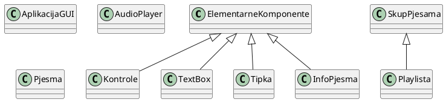

# Klase

```plantuml
@startuml

class ElementarneKomponente {
}

ElementarneKomponente <|-- Kontrole
ElementarneKomponente <|-- TextBox
ElementarneKomponente <|-- Tipka
ElementarneKomponente <|-- InfoPjesma

class Kontrole {
}
class TextBox {
}
class Tipka {
}
class InfoPjesma {
}

class SkupPjesama {
}

SkupPjesama <|-- Playlista

class Playlista {
}

class AplikacijaGUI {
}

class AudioPlayer {
}

class Pjesma {
}

@enduml

```